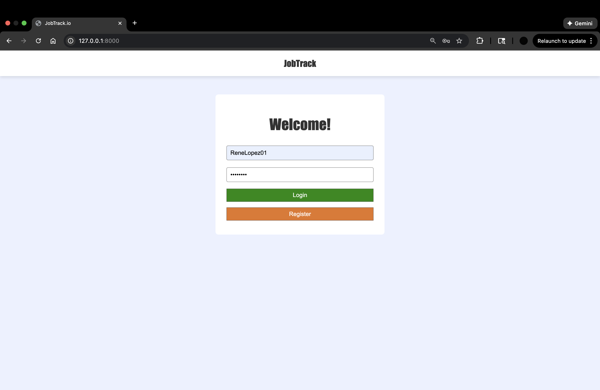
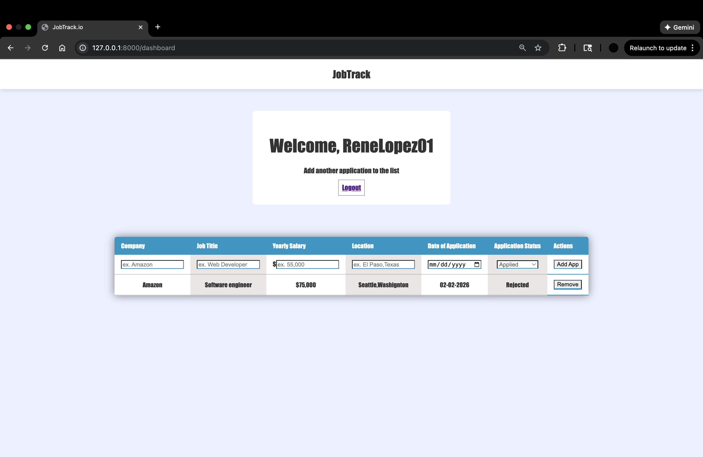
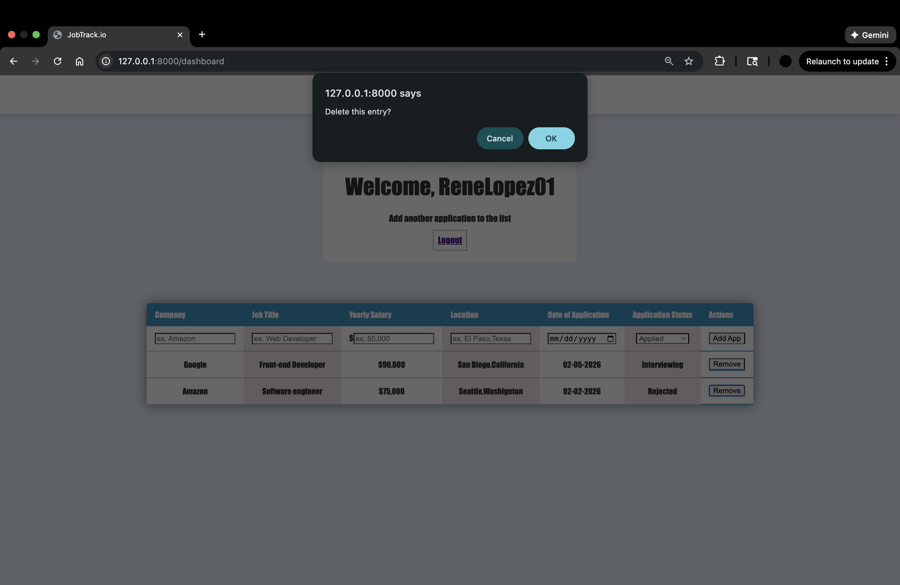

# JobTrack.io – Job Application Tracker  

JobTrack.io is a full-stack web application that helps users track and manage their job applications in one place. Users can create an account, log in, and maintain a personalized dashboard where they can add, view, and delete job applications with details such as company name, job title, salary, location, application date, and application status.

This project was built to practice real-world full-stack development concepts including backend APIs, databases, authentication, and dynamic front-end rendering.

---

## Features  

- User authentication (Register / Login / Logout)  
- Secure password hashing  
- Add new job applications  
- View applications in a paginated dashboard  
- Delete existing applications  
- Salary formatting and date formatting  
- Server-side rendering using Jinja templates  
- Clean and responsive UI styled with SCSS/CSS  

---

## Tech Stack  

**Frontend:**  
- HTML  
- SCSS / CSS  
- Jinja2 (Flask templating)  

**Backend:**  
- Python  
- Flask  
- Flask-SQLAlchemy  

**Database:**  
- SQLite  

**Other:**  
- Werkzeug (password hashing)  

---

## Screenshots  

### Login / Register  


### Dashboard  


### Add Application  


### Delete Application 


### Final Result


## Project Structure  

```bash
project/
│
├── main.py
├── instance
|   ├──users.db
|
├── templates/
│   ├── base.html
│   ├── index.html
│   └── dashboard.html
│
├── static/
│   └── styles.css
│
└── README.md
